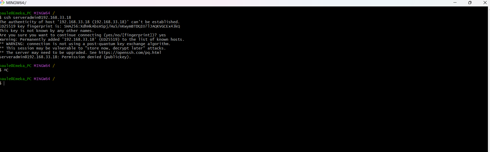

# Incident 001 SSH Permission Denied

Date:
May 18 2026

Issue:
Unable to remotely access Ubuntu server via SSH.

Symptoms:
SSH permission denied (publickey).

<figure>
  
  <figcaption>Figure 1: SSH permission denied.</figcaption>
</figure>

Investigation:

- Verified IP connectivity
- Confirmed SSH daemon was running
- Revied SSH client debug logs.
- Examined SSH server authentication settings.

Root Cause:
SSH server was configured to only allow public-key authentication, while the client did not have an authorised key configured.

Resolution:

- Generated an SSH key pair.
- Added public key to authorized_keys of Ubuntu server.
- Verified permissions on ~/.ssh and authorized_keys.
- Successfully authenticated using public key.

<figure>
  
  <figcaption>Figure 1: SSH remote server access permission fixed.</figcaption>
</figure>

Verification:
Successful remote login confirmed.

Lessons Learned:
Understanding SSH authentication methods and key management is critical for secure Linux Administration.
