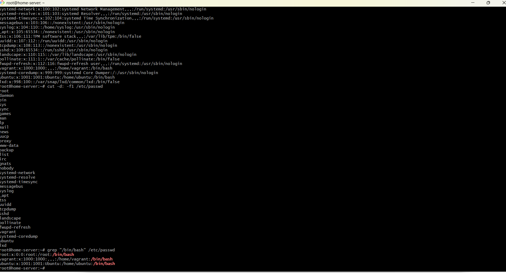
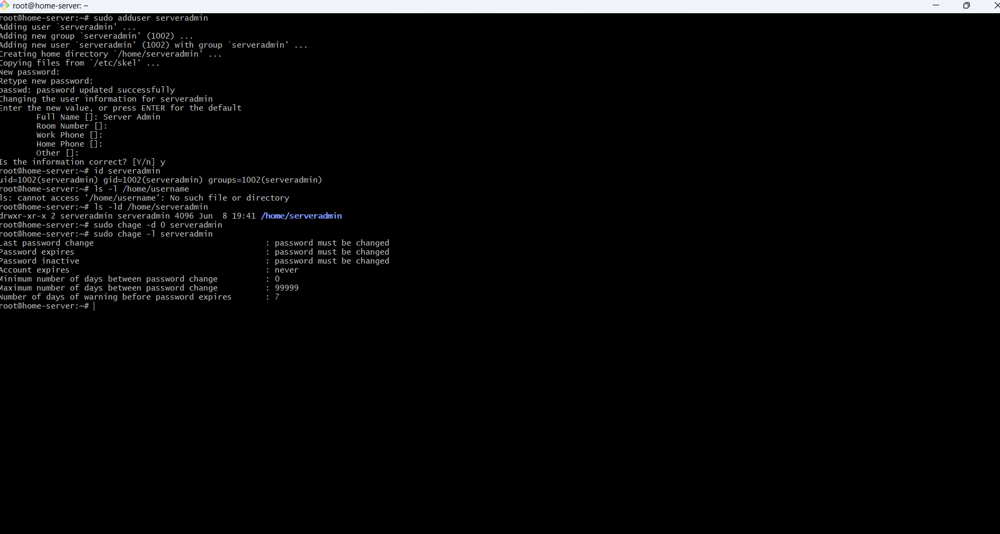
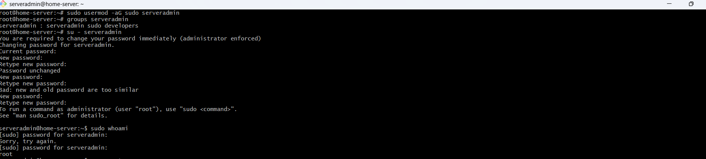
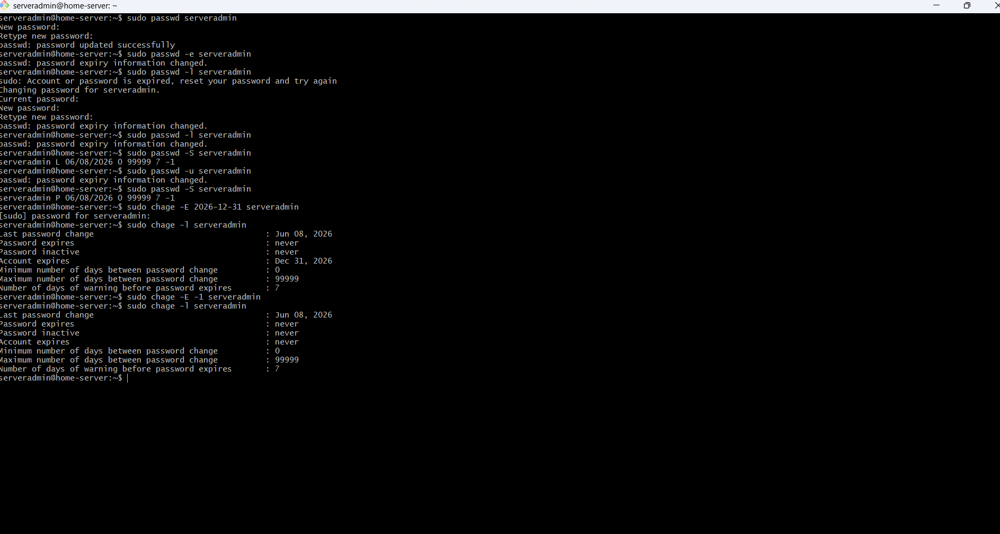
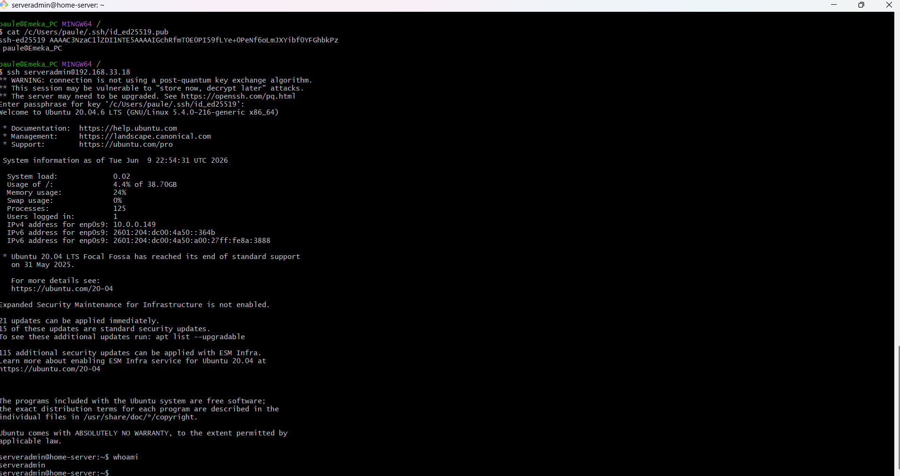

<!-- Images and screnshots -->

# User Management Runbook

## Ubuntu Linux Environment

### Purpose

This runbook provides procedures for managing user accounts, groups, permissions, access control, and user-related incidents on Ubuntu Linux servers.

### Scope

Applies to:

- Ubuntu Server 20.04 LTS
- Ubuntu Server 22.04 LTS
- Ubuntu Server 24.04 LTS

Responsibilities Covered:

- User Provisioning
- User Deprovisioning
- Group Administration
- Privilege Management
- Password Management
- Account Auditing
- Incident Response

---

## 1. User Account Administration

### Verify Existing Users

Display all local users:

```
cat /etc/passwd
```

Display only usernames:

```
cut -d: -f1 /etc/passwd
```

List users with login shells:

```
grep "/bin/bash" /etc/passwd
```

---

## View Current Logged-in Users

```
who
```

Alternative:

```
w
```

---

## View User Details

```
id username
```

Example:

```
id vagrant
```

Expected Output:

```text
uid=1000(vagrant) gid=1000(vagrant) groups=1000(vagrant)


<figure>
  
  <figcaption>Figure 1: Verify existing users.</figcaption>
</figure>


```

---

## 2. User Provisioning

### Create New User

```
sudo adduser username
```

Example:

```
sudo adduser serveradmin
```

The system will:

- Create user account
- Create home directory
- Create user group
- Prompt for password

---

## Verify User Creation

```
id username
```

```
ls -ld /home/username
```

---

## Force Password Change at First Login

```
sudo chage -d 0 username
```

Verify:

```
sudo chage -l username
```

---

# 3. Group Management

## View Groups

```
cat /etc/group
```

---

## Create New Group

```
sudo groupadd developers
```

Verify:

```
getent group developers
```

---

## Add User to Group

```
sudo usermod -aG developers username
```

Example:

```
sudo usermod -aG developers serveradmin
```

Verify:

```
groups serveradmin
```

---

## Remove User from Group

```
sudo gpasswd -d username developers
```

Verify:

```
groups username
```

<figure>
  
  <figcaption>Figure 2: Create new user.</figcaption>
</figure>

---

## 4. Sudo Administration

### Grant Administrative Privileges

Add user to sudo group:

```
sudo usermod -aG sudo username
```

Verify:

```
groups username
```

Expected:

```text
*username : username sudo group*
```

---

### Test Sudo Access

Switch user:

```
su - username
```

Run:

```
sudo whoami
```

Expected:

```text
*root*
```

---

### Remove Sudo Access

```
sudo deluser username sudo
```

Verify:

```
groups username
```

<figure>
  
  <figcaption>Figure 2: Grant sudo acces.</figcaption>
</figure>

---

## 5. Password Management

### Change User Password

```
sudo passwd username
```

---

## Force Password Expiration

```
sudo passwd -e username
```

---

## Lock User Account

```
sudo passwd -l username
```

Verify:

```
sudo passwd -S serveradmin
```

Expected:

```text
serveradmin L 06/08/2026 0 99999 7 -1
```

---

## Unlock User Account

```
sudo passwd -u username
```

Verify:

```
sudo passwd -S username
```

Expected:

```text
serveradmin P 06/08/2026 0 99999 7 -1
```

---

## 6. Account Expiration

### Set Account Expiration Date

```
sudo chage -E 2026-12-31 username
```

Verify:

```
sudo chage -l username
```

---

## Remove Expiration Date

```
sudo chage -E -1 username
```

<figure>
  
  <figcaption>Figure 4: Password management.</figcaption>
</figure>

---

## 7. SSH Access Management

### Create SSH Directory

```
mkdir -p ~/.ssh
chmod 700 ~/.ssh
```

---

### Generate Public SSH Key on Local Machine

First confirm if local key exists (.pub file)

```
ls -la ~/.ssh
```

Generate key:

```
ssh-keygen -t ed25519
```

Manually copy key from local machine to server:

```
cat <directory>/.ssh/id_ed25519.pub
```

---

### Add Public Key to Ubuntu Server Authorized_keys

Copy public key from local machine and manually paste inside ~/.ssh/authorized_keys:

```
vim ~/.ssh/authorized_keys
```

Set permissions:

```bash
chmod 600 ~/.ssh/authorized_keys
```

---

## Verify Ownership

```bash
ls -la ~/.ssh
```

Correct ownership:

```bash
sudo chown -R username:username ~/.ssh
```

<figure>
  
  <figcaption>Figure 1: SSH remote server access permission fixed.</figcaption>
</figure>

---

# 8. User Deprovisioning

## Disable User Access Immediately

Lock account:

```bash
sudo passwd -l username
```

Expire account:

```bash
sudo chage -E 0 username
```

---

## Backup User Data

```bash
sudo tar -czvf \
username-home-backup.tar.gz \
/home/username
```

---

## Remove User

Keep home directory:

```bash
sudo userdel username
```

Remove home directory:

```bash
sudo userdel -r username
```

---

## Verify Removal

```bash
id username
```

Expected:

```text
no such user
```

---

# 9. User Auditing

## List Users with UID ≥ 1000

```bash
awk -F: '$3 >= 1000 {print $1}' /etc/passwd
```

---

## List Users with Sudo Access

```bash
getent group sudo
```

---

## Find Locked Accounts

```bash
sudo passwd -Sa
```

---

## Last Login Information

```bash
lastlog
```

Specific user:

```bash
lastlog -u username
```

---

## User Login History

```bash
last
```

---

# 10. Incident Response

## Incident A: User Cannot Log In

### Symptoms

```text
Login incorrect
```

### Investigation

```bash
id username
sudo passwd -S username
sudo chage -l username
```

### Resolution

Unlock account:

```bash
sudo passwd -u username
```

Reset password:

```bash
sudo passwd username
```

---

## Incident B: User Cannot Use Sudo

### Symptoms

```text
username is not in the sudoers file
```

### Investigation

```bash
groups username
```

### Resolution

```bash
sudo usermod -aG sudo username
```

User must log out and back in.

---

## Incident C: Home Directory Permission Issues

### Investigation

```bash
ls -ld /home/username
```

### Resolution

```bash
sudo chown -R username:username /home/username
```

```bash
sudo chmod 750 /home/username
```

---

## Incident D: SSH Key Authentication Failure

### Investigation

```bash
ls -la ~/.ssh
```

```bash
cat ~/.ssh/authorized_keys
```

### Resolution

```bash
chmod 700 ~/.ssh
chmod 600 ~/.ssh/authorized_keys
```

Verify ownership:

```bash
sudo chown -R username:username ~/.ssh
```

---

# 11. Verification Checklist

Verify:

- User account exists
- User belongs to correct groups
- Password policy enforced
- SSH access validated
- Sudo permissions tested
- Home directory ownership correct
- Login successful
- Audit logs reviewed

Validation Commands:

```bash
id username
groups username
sudo passwd -S username
sudo chage -l username
lastlog -u username
```

---

# Escalation Criteria

Escalate if:

- Unauthorized account creation detected
- Privilege escalation suspected
- Multiple failed login attempts observed
- Sudoers file corruption identified
- Authentication services unavailable
- Large-scale user access outage occurs

---

# References

Ubuntu User Management

```bash
man useradd
man adduser
man usermod
man passwd
man groupadd
man chage
```

Authentication Logs

```bash
man last
man lastlog
```
